# Cascaded Power Modelling

Code to reproduce results from:

> C. Harvey and S. J. Savory, "Optical Power Spectrum Prediction Using Cascaded Learning With Uncertainty Propagating Noisy Input Gaussian Processes," in Journal of Lightwave Technology, vol. 43, no. 16, pp. 7639 to 7649, 15 Aug 2025, doi: 10.1109/JLT.2025.3580113.

## What this is

The repository models a cascaded optical link made of six EDFA (Erbium Doped Fibre Amplifier) stages separated by spans of fibre. Each EDFA stage is modelled separately, and the predicted output power of one stage feeds into the next stage as input, propagating both the predicted power and (for the Gaussian Process models) the predicted uncertainty all the way through the cascade.

Three modelling approaches are implemented for the individual EDFA stages:

| Approach | Folder | Notes |
| --- | --- | --- |
| Artificial Neural Network | `ann/` | Deterministic, no uncertainty propagation |
| Gaussian Process | `gp/` | Standard GP cascade |
| Noisy Input Gaussian Process | `gp/` (`uncertain=True`) | Propagates input uncertainty between stages using the custom kernels in `kernels/` |

```mermaid
flowchart LR
    In([Input power spectrum]) --> E1[EDFA 1]
    E1 --> F1[Fibre span 1]
    F1 --> E2[EDFA 2]
    E2 --> F2[Fibre span 2]
    F2 --> E3[EDFA 3]
    E3 --> F3[Fibre span 3]
    F3 --> E4[EDFA 4]
    E4 --> F4[Fibre span 4]
    F4 --> E5[EDFA 5]
    E5 --> F5[Fibre span 5]
    F5 --> E6[EDFA 6]
    E6 --> Out([Predicted output power spectrum])
```



For the Noisy Input Gaussian Process models, the variance estimated at each EDFA stage is combined with the fibre loss variance and carried forward as the input uncertainty for the next stage, instead of being discarded.

## Repository structure

```
Cascaded Power Modelling/
├── ann/                 ANN model definitions, one file per EDFA stage, plus an end to end model
├── gp/                  GP and NIGP model definitions, plus shared loading and inference helpers
├── kernels/             Custom GPyTorch kernels and mean functions used by the NIGP models
├── data/                Measured input and output power spectra, EDFA settings, and channel
│                        on/off permutations for each EDFA stage and fibre span
├── models/
│   ├── ann/             Trained ANN weights (.pth)
│   ├── gp/              Trained GP weights and training data
│   └── nigp/            Trained NIGP weights and training data
├── train_ann.py         Entry point for training the ANN cascade
├── train_gp.py          Entry point for training the GP or NIGP cascade
└── requirements.txt
```

Each `data/EDFA n` folder holds four files: `Inputs.csv` and `Outputs.csv` (measured power per channel, 16 channels), `EDFA_setting.csv` (the gain setting used), and `perms.csv` (which channels were on or off for that measurement). `data/fibre n` holds the same four files for the fibre span between EDFA `n` and EDFA `n+1`. EDFA 6 corresponds to the full link, so its data is also used to train the end to end models.

## Setup

```
pip install -r requirements.txt
```

The code expects a CUDA GPU (`torch.device("cuda")` is used throughout) but will fall back to CPU automatically if one is not available.

## Usage

Run everything from the repository root so the relative paths in the scripts resolve correctly.

Train the full ANN cascade:

```
python train_ann.py
```

Train the full GP cascade, with or without uncertainty propagation:

```python
from train_gp import trainAllModels
trainAllModels(uncertain=False)  # standard GP cascade
trainAllModels(uncertain=True)   # NIGP cascade
```

Both `train_ann.py` and `train_gp.py` also expose `trainSingleEDFAModel(x)` for retraining a single stage, and `trainEndToEnd()` for training the end to end model directly on the full link measurements (EDFA 6 data). The `if __name__ == "__main__":` block at the bottom of each script shows these in use, commented out, and can be edited to choose which routine to run.

Trained models are written to `models/ann`, `models/gp`, or `models/nigp` and are reloaded from the same locations by the `*_ModelLoad.py` helpers when running inference or chaining stages together.

## Citation

If you use this code, please cite the paper above.
